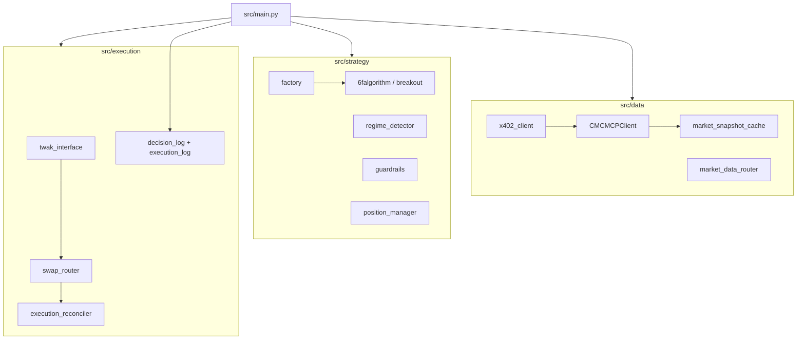

<div align="center">

# NoNamedYet_Bot

**Autonomous BSC trading agent for the BNB Hack — AI Trading Agent Edition**

*Rule-based momentum breakout · TWAK self-custody execution · CMC market data · strict guardrails*

<br/>

| | |
|:---:|:---:|
| **Chain** | BNB Smart Chain (BSC) |
| **Agent schema** | `2.6.0` |
| **Default strategy** | `breakout` |
| **Loop interval** | `300s` (5 min) |
| **Tests** | `439+` pytest cases |

<br/>

</div>

[Quick Start](#quick-start) · [Run Modes](#run-modes) · [Strategy](#strategy-modes) · [Architecture](#architecture) · [Logs](#logs--telemetry)

---

## Overview

**NoNamedYet_Bot** is a production-minded Python trading agent that evaluates a focused universe of high-liquidity BNB Chain tokens, applies regime-aware guardrails, and executes swaps through **TWAK** — so Python never holds a trading private key.

| Design principle | What it means |
| --- | --- |
| **Deterministic strategy core** | Rule-based breakout scoring drives entries; runtime behavior does not depend on ML training |
| **No custom execution server** | All writes go through verified TWAK CLI subprocesses |
| **Fail-closed risk** | Slippage, drawdown, and daily limits block entries before capital moves |
| **Append-only audit trail** | Every cycle and swap is logged to JSONL for replay and demo proof |

> **Onboarding tip:** see `ASSESSMENT.md` for the latest readiness audit and current blockers.

---

## What it does today

Each trading cycle (every `LOOP_SECONDS`, default **5 minutes**):

```
┌─────────────┐    ┌──────────────┐    ┌─────────────┐    ┌──────────────┐
│ Fetch CMC   │───▶│ Detect regime│───▶│ Score tokens│───▶│ Guardrails   │
│ snapshot    │    │ + sentiment  │    │ (strategy)  │    │ check        │
└─────────────┘    └──────────────┘    └─────────────┘    └──────┬───────┘
                                                                  │
                    ┌──────────────┐    ┌──────────────┐            ▼
                    │ Reconcile tx │◀───│ TWAK swap    │◀─── ENTER or WAIT
                    │ on-chain     │    │ (live only)  │
                    └──────────────┘    └──────────────┘
```

1. **Market data** — CoinMarketCap trial REST quotes (and optional x402-paid enrichment when a micropayment signer is configured).
2. **Regime & sentiment** — BNB trend, Fear & Greed, funding, and gas inform risk posture.
3. **Strategy evaluation** — `breakout` scores momentum, volume, market context, and quote safety before entry.
4. **Position management** — Monitor open trades every `POSITION_MONITOR_SECONDS`; exit on TP, SL, trailing stop, or time stop.
5. **Live execution** — TWAK quote-only slippage checks → swap → on-chain reconciliation before persisting local state.
6. **Telemetry** — Structured logs under `logs/` plus legacy `decision_log.jsonl` / `execution_log.jsonl`.

---

## Verified state

> Last audited: **2026-06-21**

| Capability | Status |
| --- | --- |
| TWAK CLI swap + approval on BSC | ✅ Proven ([artifact](demo_artifacts/real_twak_swap_2026-06-04.md)) |
| Live balance reads via `bnb-chain-agentkit` | ✅ |
| Autonomous decision + execution JSONL logging | ✅ |
| On-chain execution reconciliation | ✅ |
| Dual CMC data path (REST + x402 enrichment) | ✅ Proven in production |
| Autonomous loop producing funded live swaps | ✅ Proven ([proof](demo_artifacts/ON_CHAIN_PROOF.md)) |
| End-to-end paid CMC x402 in production | ✅ Proven in production |

**Recent on-chain proof (live agent loop):**

| Action | Tx hash |
| --- | --- |
| Entry USDC → ETH | [`0x5cbb...6ad7`](https://bscscan.com/tx/0x5cbbdce2a5940578d129ede506765d5fdbd383d4c6ca5a2800296d893b0d6ad7) |
| Compliance USDC → TWT | [`0x4a0f...8d43`](https://bscscan.com/tx/0x4a0f675dea79f0888ff863998fe075d9e27f085b09d8a599cd83214a93d38d43) |
| Exit UNI → USDC | [`0x6271...8de1`](https://bscscan.com/tx/0x62717341a947fe5df804f310e149f8af5ee170fc26c46fe7f3a7dd4d84798de1) |

See [`demo_artifacts/ON_CHAIN_PROOF.md`](demo_artifacts/ON_CHAIN_PROOF.md) for the full list.

---

<a id="architecture"></a>

## Architecture



| Module | Responsibility |
| --- | --- |
| `src/main.py` | CLI, 5-minute agent loop, preflight, emergency liquidation |
| `src/data/` | CMC Keyless quotes, x402 micropayments, snapshot caching |
| `src/strategy/` | Breakout engine, regime, sentiment, guardrails, position manager |
| `src/execution/` | TWAK subprocess wrapper, swap routing, on-chain reconciliation |
| `src/config/` | Settings, token allowlists, env-only secrets |
| `scripts/` | Smoke tests, shadow replay, emergency shell helpers |

---

<a id="strategy-modes"></a>

## Strategy

Set `STRATEGY_MODE=breakout` in `.env`. The production bot uses the momentum breakout algorithm.

### Momentum breakout

The engine scans the tradable BNB Chain universe, scores candidates from **0–100**, quotes only candidates near the entry threshold, and enters only when quote safety and anti-chase rules pass.

| Signal | Intent |
| --- | --- |
| Volume breakout | 1h volume expands versus the rolling 24h hourly average |
| Price breakout | Price clears recent reference highs with a configurable buffer |
| Market context | BNB trend, sentiment, gas, and macro checks avoid risk-off entries |
| Quote safety | TWAK quote-only slippage must stay below the configured cap |
| Ranking context | RSI, derivatives, and momentum improve candidate ordering |

| Parameter | Default |
| --- | --- |
| Position size | up to 5% of portfolio |
| Trailing stop | 6% below peak |
| Take profit | +8% |
| Max daily trades | 3 |
| Max daily loss | 2% → 24h pause |
| Entry score | `BREAKOUT_ENTRY_SCORE_MIN=45` |
| Max slippage | 1% |

---

## Risk guardrails

> Guardrails are **never** bypassed for demo or competition windows.

| Control | Behavior |
| --- | --- |
| Tradable allowlist | `TRADABLE_TARGET_SYMBOLS` only |
| Drawdown soft stop | 10% |
| Drawdown kill switch | 18% → liquidate & halt |
| Max swap slippage | 1% |
| Daily trade limit | 3 entries |
| Daily loss cap | 2% → 24h pause |
| Emergency liquidation | `python -m src.main --emergency-liquidate` |

Stables (USDC / USDT) are settlement tokens — not directional entry targets.

---

<a id="quick-start"></a>

## Quick start

```bash
python -m venv .venv
source .venv/bin/activate
pip install -r requirements.txt
cp .env.example .env
```

Edit `.env` with RPC URLs, wallet address, and TWAK unlock before live trading.

**Required for live mode:**

```env
BSC_PROVIDER_URL=...
AGENT_WALLET_ADDRESS=...
WALLET_ADDRESS=...
PAPER_TRADE=false
```

**TWAK wallet unlock** (pick one):

```bash
# Preferred — OS keychain
twak wallet keychain save --password '<wallet-password>'
twak wallet keychain check

# Or local-only (never commit)
TWAK_WALLET_PASSWORD=...
```

```bash
pytest
```

---

<a id="run-modes"></a>

## Run modes

| Command | Description |
| --- | --- |
| `python -m src.main --paper-trade` | Deterministic paper execution *(default when neither flag is set)* |
| `python -m src.main --live` | Live TWAK swaps on BSC |
| `python -m src.main --live --preflight` | Readiness checks — no broadcasts |
| `python -m src.main --live --once` | Single cycle then exit |
| `python -m src.main --live --demo-mode` | Compact per-cycle stdout summary |
| `python -m src.main --live --balance` | Print wallet balances and exit |
| `python -m src.main --emergency-liquidate` | Sell open positions → USDC |
| `python -m src.main --live --withdraw SYMBOL --to 0x… --amount N` | Transfer tokens out |

**Examples:**

```bash
# Paper loop (safe default)
python -m src.main --paper-trade

# Live with preflight first
python -m src.main --live --preflight
python -m src.main --live

# Dry-run emergency exit
python -m src.main --emergency-liquidate --paper-trade
```

---

## Market data

Three paths — configured via `.env`:

| Mode | Env | Behavior |
| --- | --- | --- |
| **Dual** *(recommended live)* | `USE_DUAL_MARKET_DATA=true` | Trial REST every loop; x402 enrichment on `CMC_SNAPSHOT_TTL_SECONDS` cadence |
| **Keyless only** | `USE_KEYLESS_PRIMARY=true` | Trial REST snapshots only |
| **MCP shadow** | `CMC_MCP_ENABLED=true` + `CMC_MCP_SHADOW_MODE=true` | Exercise x402 MCP without affecting trading data |

x402 micropayments use `CMC_X402_EPHEMERAL_KEY` (isolated in `src/data/` — **not** the TWAK trading wallet).

**Verified TWAK commands:**

```bash
twak wallet create
twak compete register
twak wallet address --chain bsc --json
twak swap <amount> <from> <to> --slippage <pct> --chain bsc --quote-only --json
twak swap <amount> <from> <to> --slippage <pct> --chain bsc --json
twak x402 pay --url <endpoint> --amount <amount> --asset <token> --chain base --json
```

> Internal slippage is stored as a fraction (`0.01` = 1%). TWAK CLI expects percent (`--slippage 1`).

**Smoke scripts:**

```bash
python scripts/smoke_cmc_mcp.py
python scripts/smoke_cmc_x402_paid_quote.py
python scripts/replay_shadow.py
```

---

<a id="logs--telemetry"></a>

## Logs & telemetry

### Structured (`logs/`)

| File | Contents |
| --- | --- |
| `decision_live.jsonl` | Per-cycle ENTER / WAIT / BLOCKED / HALT with factor scores |
| `portfolio_snapshots.jsonl` | Portfolio value, drawdown, open positions |
| `risk_events.jsonl` | Kill switch, pause, and limit breaches |
| `sentiment_live.jsonl` | FGI, funding, gas snapshots |
| `decision_shadow.jsonl` | Parallel strategy variants for research |

### Legacy (root)

| File | Contents |
| --- | --- |
| `decision_log.jsonl` | Compact strategy decisions |
| `execution_log.jsonl` | Swap attempts, tx hashes, errors |

Override paths with `DECISION_LOG_PATH`, `EXECUTION_LOG_PATH`, `POSITION_STATE_PATH`, and `GUARDRAIL_STATE_PATH`.

---

## Key environment variables

<details>
<summary><strong>Click to expand full env reference</strong></summary>

```env
# Strategy
STRATEGY_MODE=breakout
LOOP_SECONDS=300
POSITION_MONITOR_SECONDS=60

# Market data
USE_DUAL_MARKET_DATA=true
CMC_SNAPSHOT_TTL_SECONDS=14400
CMC_KEYLESS_SNAPSHOT_TTL_SECONDS=300
USE_KEYLESS_PRIMARY=false
CMC_MCP_ENABLED=false
CMC_MCP_SHADOW_MODE=false

# x402 (Base micropayments for CMC enrichment)
CMC_X402_EPHEMERAL_KEY=
CMC_X402_AMOUNT=0.015
CMC_X402_ASSET=0x833589fCD6eDb6E08f4c7C32D4f71b54bdA02913
CMC_X402_CHAIN_ID=8453

# Risk
MAX_POSITION_PCT=0.05
MAX_DAILY_TRADES=3
MAX_DAILY_LOSS_PCT=0.02
DRAWDOWN_KILL_SWITCH_PCT=0.18
BREAKOUT_ENTRY_SCORE_MIN=45
```

See `src/config/settings.py` and `.env.example` for the complete list.

</details>

---

## Breakout Engine Scoring v2.0

The v2.0 scoring upgrade introduces a **regime-aware, continuous-factor** entry model with tighter guardrails and full A/B telemetry.

- **Regime-adjusted weights** shift emphasis between volume, momentum, and breakout strength based on the token's ATR ratio (`high vol` → momentum ↑, `low vol` → volume ↑).
- **Graded RSI** replaces the old binary band with a continuous curve peaking at 65, zeroing at 45 and 85.
- **Continuous derivatives** score funding and open-interest jointly; missing data scores neutral (`0.5`) until a real Binance feed is wired.

### Key changes at a glance

- **Entry threshold:** `BREAKOUT_ENTRY_SCORE_MIN=45.0` by default; the effective TWAK quote floor is `48.0` because quotes are only requested for candidates scoring `threshold + 3`.
- **Hard regime block:** `BREAKOUT_BLOCK_IN_RISK_OFF_REGIME=true` — entries are blocked outright in risk-off markets (not just sized down).
- **Factor-matrix telemetry:** `FACTOR_MATRIX_LOG_ENABLED=false` by default; set to `true` to write one JSONL row per symbol per cycle for offline A/B testing and model training.

---

## Known gaps

- [x] Autonomous loop has persisted funded live swaps end-to-end (see `demo_artifacts/ON_CHAIN_PROOF.md`).
- [x] Paid CMC x402 enrichment is proven in production (see `bot_live.log` and x402 wallet ledger).
- [ ] Unattended production should harden state recovery beyond JSON file persistence.

---

## Competition Economics

- **$20 AUM + $5 x402 budget = a lean, capital-efficient trading agent.** The default config allocates 25% of capital to intelligence and 75% to trading — a ratio borrowed from institutional quant funds, scaled down for a one-week hackathon.
- **$0.714/day for data is enough to keep premium signals running** across the eligible BSC universe when paired with the free CMC Keyless quote feed and regime-aware TTL throttling.
- **x402 per-request latency is 2–5 seconds.** Use T2 ≥ 300s or prepaid bundles to avoid request pile-up.
- **Real all-in cost per call is $0.011–$0.015, not $0.01.** The extra covers BNB gas + CDP facilitator fees.
- **n* = 1 is a theoretical limit.** In practice, use n = 3–5 for diversification as AUM grows.

---

## Budget Model: 25% of AUM for Data

This bot follows the institutional quant fund principle: **intelligence budget scales with capital**.

- **$20 AUM → $5 total data budget over 7 days → $0.714/day**
- The remaining $15 is trading capital (position sizing) — untouched by x402 spend.
- This lean budget is sufficient for the one-week competition because the dual-market-data architecture combines free Keyless quotes every cycle with targeted x402-paid enrichment only for the top candidates and open positions.
- At higher AUMs, the same 25% allocation unlocks more symbols and faster refresh intervals.

See `src/data/x402_optimizer.py` for the Lagrangian-derived bang-bang solution.

---

## Math Verification

The optimization framework was verified by a **6-agent swarm**:

1. **Lagrangian & FOCs:** Re-derived and cross-checked against KKT conditions.
2. **Numerical grid search:** 4M evaluations, exact match with analytical solution.
3. **Matrix formulation:** Numpy `allclose` verified against scalar/vector form.
4. **Signal decay (λ):** BSC-adjusted per-hour rates from CoinQuant backtests.
5. **Alpha estimation (α):** Calibrated at $2K position, linearly scalable to any AUM.
6. **Coverage function (β):** Empirical β = 0.12 from CCi30 market-cap concentration.

Full report: see `src/data/x402_optimizer.py` and the budget-governance tests in `tests/test_x402_optimizer.py`.

---

## Project layout

```
NoNamedYet_Bot/
├── src/
│   ├── main.py              # Agent loop & CLI
│   ├── config/              # Settings, tokens, secrets
│   ├── data/                # CMC + x402 clients
│   ├── execution/           # TWAK, swaps, reconciliation
│   └── strategy/            # Breakout, regime, guardrails
├── tests/                   # Pytest suite
├── scripts/                 # Smoke & ops helpers
├── logs/                    # Structured telemetry (gitignored contents)
├── demo_artifacts/          # On-chain proof writeups
├── .env.example
└── ASSESSMENT.md            # Latest readiness audit and current blockers
```

---

<div align="center">

**Built for BNB Hack Track 1** · TWAK self-custody · CoinMarketCap data · No private keys in Python. Some cool guy I worked with told me updating the README sometimes fixed CI/CD pipelines 

</div>
